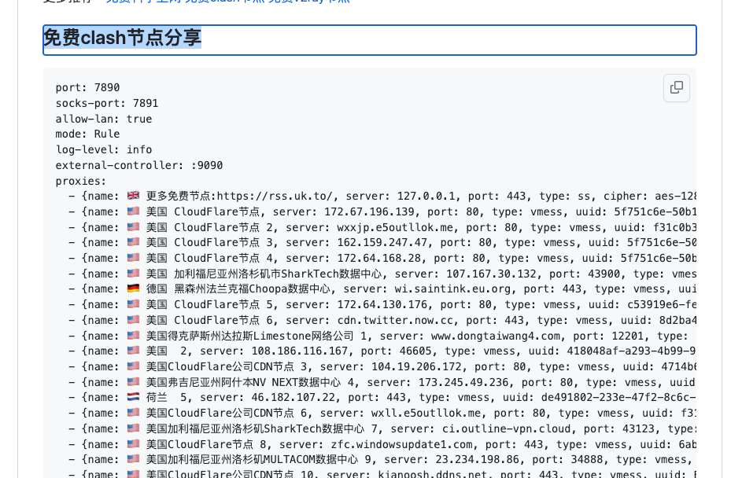

# 免费科学上网

## 首先得能正常访问github

Github 作为全球最大的开源社区和代码托管平台，蕴藏着非常多的宝藏项目，即使不是程序员，也应该熟练掌握其使用技巧，学会找到解决问题之道。

FastGithub 是一个 Github 加速神器，可以解决 github 打不开、用户头像无法加载、releases 无法上传下载等问题。

参考文章：[GitHub访问慢打不开？快使用加速神器FastGithub][fastgithub]

[fastgithub]: https://geekxtop.github.io/guide/tools/fastgithub.html

1. macOS 下载

    https://ghproxy.com/https://github.com//dotnetcore/FastGithub/releases/download/2.1.4/fastgithub_osx-x64.zip

2. 双击运行 FastGithub

   打开 FastGithub 后，目录内会生成 cacert 目录。
3. 安装证书。

   打开钥匙串访问，点击登陆，打开cacert目录，把fastgithub.cer拖入空白处，右键->显示简介->信任->使用证书选择，始终信任。
4. 打开 mac 设置，网络，点击高级，选择代理，勾选 自动代理配置，填写 FastGithub 窗口提示的地址 http://127.0.0.1:38457 。

5. 使用完毕后请手动复原。

## 在git上搜索免费结点

在 GitHub 中搜索关键字如“免费 节点”，右上角可以选择不同的排序方式筛选结果，推荐选择 Recently updated（最近更新） 可以筛选出活跃项目，这些都是收集了全网免费节点资源的项目，基本每天都会更新。

比如经过搜索，我才发现之前使用的ssh已经过时了，苹果macOS系统，我推荐您使用 ClashX，亲测https://github.com/aiboboxx/clashfree可用。

## ClashX具体使用

1. 下载安装ClashX 
2. 在https://github.com/aiboboxx/clashfree上 复制免费分享的clash结点

3. 修改config.yaml配置
打开clash客户端，配置->打开配置文件夹，将复制的结点信息覆盖config.yaml内容，保存。
4. 打开clash客户端，配置->重新加载文件。
会看到已经加载很多结点信息。
5. 设置全局代理，即可谷歌上网了。

